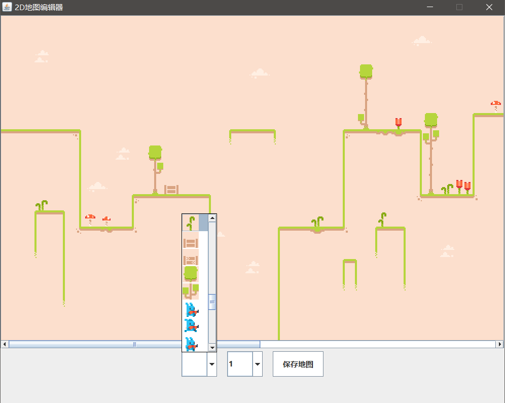

    <a>
        <h2 align="center">简易2D地图编辑器</h2>
    </a>

    
    
    

### Background
注意❗这是一个练习自用的简易2D地图编辑器🗺

### Usage
1. 素材大小与地图大小需要进入`src\MapConfig`设置

2. 将[规则贴图素材](exampleImage/mapImage.png "贴图素材")放入`images`文件夹

3. 运行程序，程序会将素材按设置的元素大小裁剪图片存回文件夹，若不是首次运行，程序会先读取`src\map`位置下的地图文件

4. 选择素材点击地图即可绘制地图，另外有三个图层可以自行选择

5. 点击保存地图即可获取地图文件`myMap.map`，位置于`src\map`

> ### 示例窗口🗔
> 

### 素材

> 免费素材来源：[KENNEY](www.kenney.nl)

### LICENSE
[**MIT**](LICENSE.md)